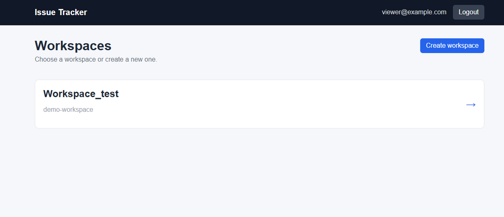
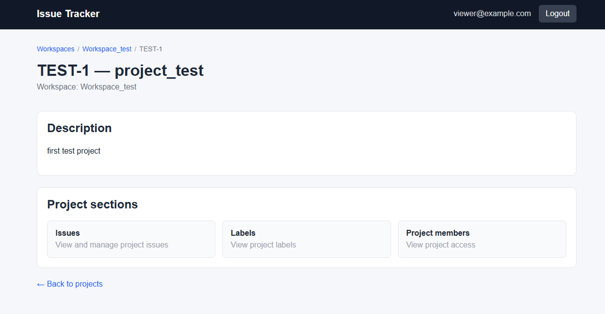
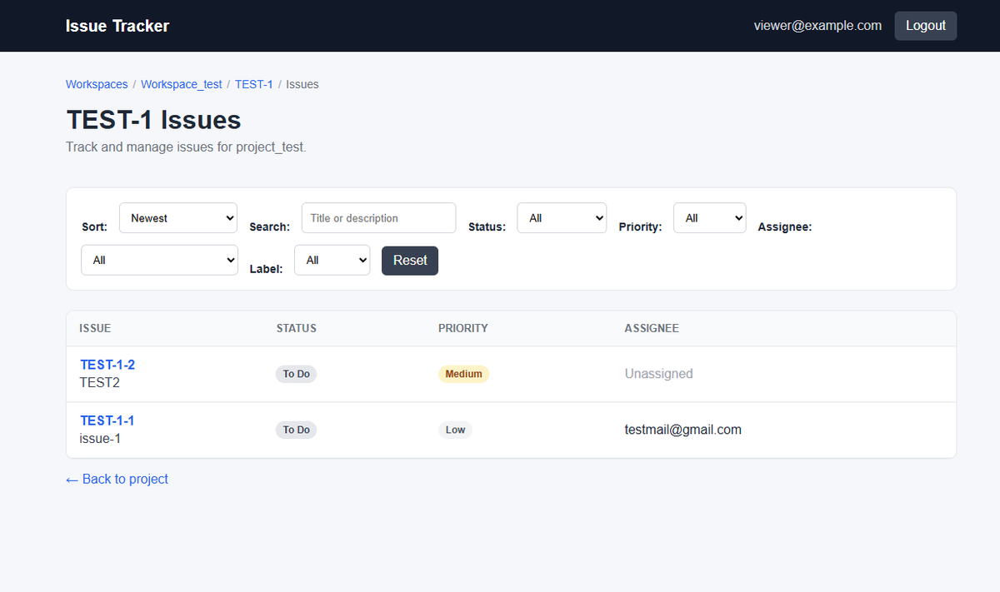
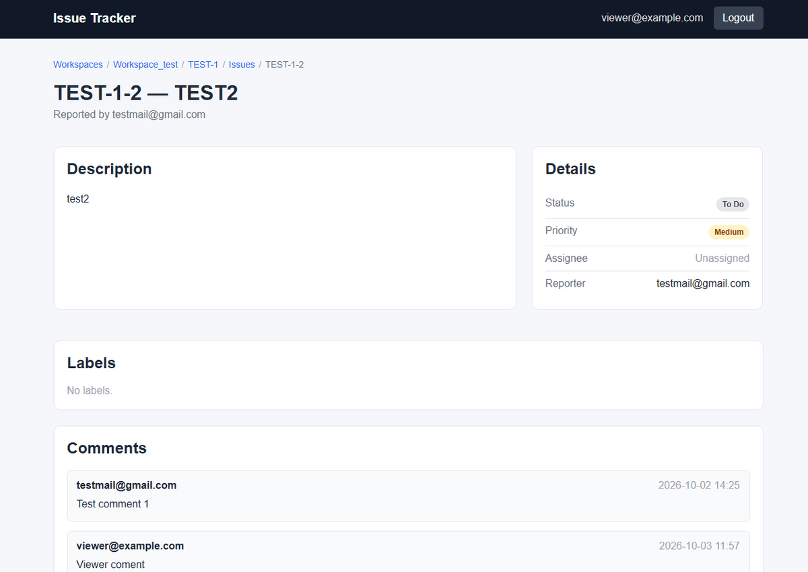
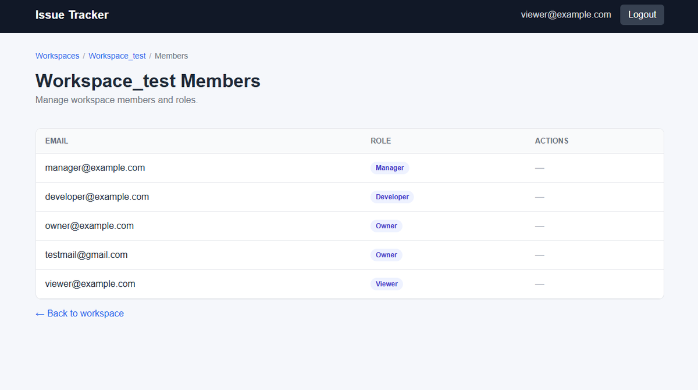

# Django Issue Tracker

A portfolio issue tracking application built with Django.

The project is inspired by tools such as Jira and provides workspaces, projects,
issues, roles, permissions, comments, labels, activity history, filtering,
search, and sorting.

## Features

### Workspaces

- Create and manage workspaces
- Workspace member management
- Role-based access control
- Multiple workspace owners
- Protection against removing or demoting the last owner

### Projects

- Create and manage projects inside a workspace
- Project-specific member access
- Automatic access for workspace Owners and Managers
- Restricted project access for Developers and Viewers

### Issues

- Create, view, update, and delete issues
- Automatic issue numbering per project
- Issue identifiers such as `BACK-1`
- Statuses:
  - Todo
  - In Progress
  - Done
- Priorities:
  - Low
  - Medium
  - High
  - Critical
- Issue assignment
- Labels
- Comments
- Activity history
- Filtering
- Search
- Sorting

## Screenshots

### Workspace overview



### Project page



### Issue list



### Issue details



### Member management



## Roles and permissions

The application uses four workspace roles.

### Owner

Owners have full workspace access.

They can:

- Edit workspace settings
- Manage workspace members and roles
- Add other Owners
- Create and manage projects
- Manage project members
- Create, edit, and delete issues
- Create labels
- Add comments

The last Owner of a workspace cannot be removed or demoted.

### Manager

Managers can manage most workspace content but cannot manage ownership.

They can:

- Manage regular workspace members
- Create and update projects
- Manage project members
- Create, edit, and delete issues
- Create labels
- Add comments

Managers cannot:

- Edit workspace settings
- Add or assign Owners
- Remove Owners

### Developer

Developers only have access to projects where they have a Project Membership.

They can:

- View accessible projects
- View issues
- Create issues
- Add comments
- Update allowed issue fields
- Assign an issue to themselves

Their ability to edit issue content is more restricted than Owner and Manager
access.

### Viewer

Viewers only have access to projects where they have a Project Membership.

They can:

- View projects and issues
- View labels
- View activity history
- Add comments

They cannot:

- Create issues
- Edit issues
- Delete issues
- Manage projects or members
- Create labels

## Tech stack

- Python 3.14
- Django 6.1
- PostgreSQL
- HTML
- CSS
- JavaScript
- Docker
- Docker Compose
- Gunicorn
- WhiteNoise
- Ruff
- GitHub Actions

## Project structure

```text
django-issue-tracker/
├── accounts/
├── config/
├── docs/
│   └── screenshots/
├── issues/
├── projects/
├── workspaces/
├── static/
├── templates/
├── .env.example
├── .env.prod.example
├── compose.prod.yml
├── docker-compose.yml
├── Dockerfile
├── manage.py
├── pyproject.toml
├── requirements.txt
└── README.md
```

The project is split into several Django applications:

- `accounts` — custom user model and authentication
- `workspaces` — workspaces, memberships, roles, and permissions
- `projects` — projects and project memberships
- `issues` — issues, labels, comments, and activity history

## Local development with Docker

Copy the example environment file:

```bash
cp .env.example .env
```

On Windows PowerShell:

```powershell
Copy-Item .env.example .env
```

Then build and start the containers:

```bash
docker compose up --build
```

The application will be available at:

```text
http://localhost:8000
```

Run migrations:

```bash
docker compose exec web python manage.py migrate
```

Create an administrator:

```bash
docker compose exec web python manage.py createsuperuser
```

## Environment variables

The development environment is configured through `.env`.

Example:

```env
SECRET_KEY=change-me-for-local-development
DEBUG=True
ALLOWED_HOSTS=localhost,127.0.0.1

DB_NAME=issue_tracker_db
DB_USER=issue_tracker_user
DB_PASSWORD=post12345
DB_HOST=db
DB_PORT=5432

EMAIL_BACKEND=django.core.mail.backends.console.EmailBackend
DEFAULT_FROM_EMAIL=webmaster@localhost
```

The real `.env` file is not committed to the repository.

For production settings, use `.env.prod.example` as a template.

## Tests

Run the Django test suite:

```bash
docker compose exec web python manage.py test
```

Run Ruff:

```bash
docker compose exec web ruff check .
```

## Continuous integration

GitHub Actions runs automatically on pushes and pull requests.

The CI pipeline currently performs:

1. Dependency installation
2. Ruff checks
3. Static file collection
4. Django tests using PostgreSQL

## Production preparation

The repository already contains production-oriented configuration for:

- Gunicorn
- WhiteNoise
- Environment-based Django settings
- PostgreSQL
- Docker Compose production overrides
- Django security settings
- Static file collection

Actual production deployment will be completed as the final stage of the
project.

## Current status

Core application functionality is implemented.

Current work is focused on:

- Final documentation
- Final production checks
- Portfolio presentation
- Deployment
